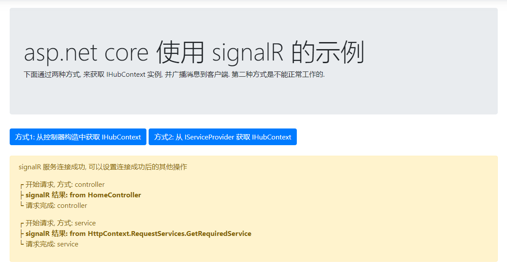

# asp.net core SignalR Demo
asp.net core 中使用 signalR 的示例
本示例中引用了库: signalr, 通过js连接并注册响应方法, 并把结果打印出来.

也为需要学习 signalr 的同学们提供示例, 希望能提供帮助.

**主要代码快速导航:**

> js: [https://github.com/dodu2014/SignalRDemo/blob/master/src/SignalRDemo/Views/Home/Index.cshtml](https://github.com/dodu2014/SignalRDemo/blob/master/src/SignalRDemo/Views/Home/Index.cshtml)
>
> hub: [https://github.com/dodu2014/SignalRDemo/blob/master/src/SignalRDemo/Hubs/TestHub.cs](https://github.com/dodu2014/SignalRDemo/blob/master/src/SignalRDemo/Hubs/TestHub.cs)
>
> controller: [https://github.com/dodu2014/SignalRDemo/blob/master/src/SignalRDemo/Controllers/HomeController.cs](https://github.com/dodu2014/SignalRDemo/blob/master/src/SignalRDemo/Controllers/HomeController.cs)

### signalR 配置:

```c#
// ConfigureServices
services.AddSignalR(configure => { configure.EnableDetailedErrors = true; });
ServicesContext.Provider = services.BuildServiceProvider(true); //注册服务上下文对象

// Configure
app.UseSignalR(routes => {
    routes.MapHub<TestHub>("/hubs/test");
});
```
### 截图


